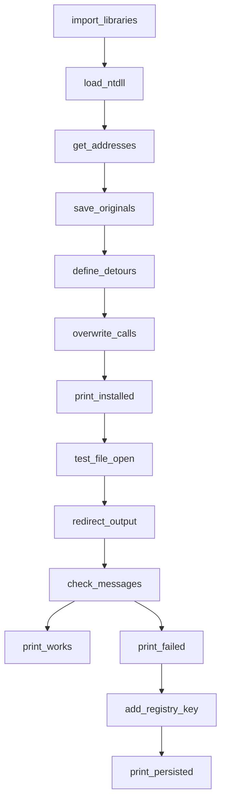

```mermaid
graph TD;
    import_libraries-->load_ntdll;
    load_ntdll-->get_addresses;
    get_addresses-->save_originals;
    save_originals-->define_detours;
    define_detours-->overwrite_calls;
    overwrite_calls-->print_installed;
    print_installed-->test_file_open;
    test_file_open-->redirect_output;
    redirect_output-->check_messages;
    check_messages-->print_works;
    check_messages-->print_failed;
    print_failed-->add_registry_key;
    add_registry_key-->print_persisted;
```
