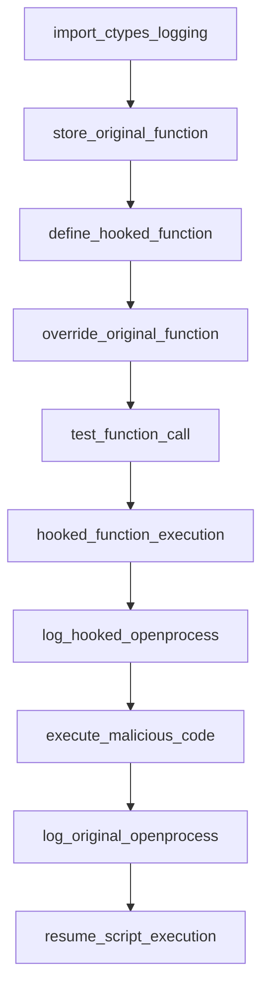

## Proof of Concept Rootkit README

### Overview
This Python script demonstrates a basic rootkit by hooking into system calls.

## Graph Representation

Here is a visual representation of the rootkit functionalities:

### Note
This proof of concept showcases basic functionalities and doesn’t cover all security aspects. Use responsibly and understand the risks associated with rootkits.
