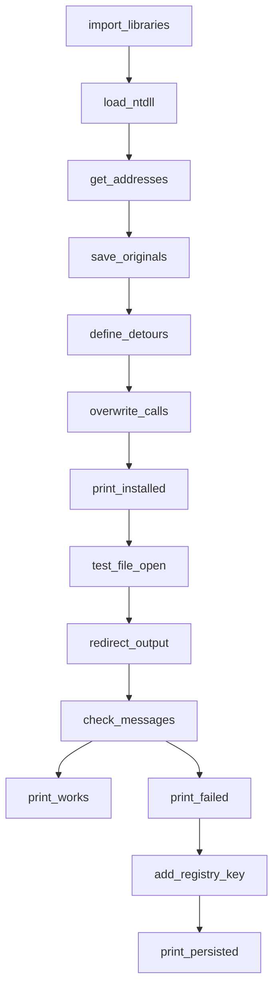

## Proof of Concept Rootkit README

### Overview
This Python script demonstrates a basic rootkit by hooking into system calls, printing messages for file actions, and attempting persistence through the Windows registry.

## Graph Representation

Here is a visual representation of the rootkit functionalities:

### Usage
1. Run `rootkit.py` on a Windows system with Python 3.x.
2. Review console output for file action messages.
3. Confirm if `log.txt` displays "[ROOTKIT] Opening file!" and "[ROOTKIT] Closing file!" after file operations.
4. Check the Windows registry key "Software\\Microsoft\\Windows\\CurrentVersion\\Run" for the "rootkit" entry to verify persistence.

### Note
This proof of concept showcases basic functionalities and doesn’t cover all security aspects. Use responsibly and understand the risks associated with rootkits.
